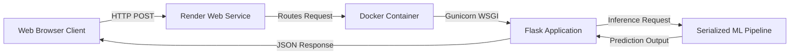

# 🏡 Boston House Price Predictor


An **end-to-end Machine Learning web application** that predicts housing prices in Boston based on socio-economic and geographical features. The model is built using a Random Forest Regressor, exposed via a Flask REST API, containerized with Docker, and deployed for production on Render.

🔗 **Live Application:** [Click Here to View Demo](https://boston-house-pricing-kj3s.onrender.com/)

---

## 📖 Table of Contents

- [Project Overview](#project-overview)
- [Tech Stack](#tech-stack)
- [Dataset & Features](#dataset-features)
- [Model Performance](#model-performance)
- [Architecture](#architecture)
- [Installation & Usage](#installation-usage)
- [Docker Support](#docker-support)
- [API Documentation](#api-documentation)
- [License](#license)

---

<a id="project-overview"></a>
## 🚀 Project Overview

This project was developed to bridge the gap between data science experimentation and production engineering. It demonstrates a complete **MLOps pipeline**:

1.  **Data Science:** Exploratory Data Analysis (EDA), feature engineering, and model training using Scikit-Learn.
2.  **Web Engineering:** Creating a user-friendly web interface and a backend API using Flask.
3.  **DevOps:** Containerizing the application using Docker to ensure reproducibility across environments.
4.  **Deployment:** Hosting the application on Render's cloud platform using a production-grade WSGI server (Gunicorn).

---

<a id="tech-stack"></a>
## 🛠 Tech Stack

| Component | Technology |
| :--- | :--- |
| **Language** | Python 3.9 |
| **Machine Learning** | Scikit-Learn, Pandas, NumPy, Random Forest Regressor |
| **Web Backend** | Flask, Gunicorn |
| **Frontend** | HTML5, CSS3, JavaScript |
| **Containerization** | Docker |
| **Deployment** | Render Cloud |
| **Version Control** | Git & GitHub |

---

<a id="architecture"></a>
## 🏗️ Architecture

The application follows a modular, production-style **ML inference architecture**:



### Architecture Notes
- Model training and tuning are performed **offline** in Jupyter notebooks.
- The deployed service handles **inference only**.
- The entire preprocessing + model logic is encapsulated in a single pipeline.
- Docker ensures environment consistency across local and cloud deployments.


---

<a id="model-performance"></a>
## 📈 Model Performance

The **Random Forest Regressor** was selected as the final model after evaluating multiple baseline models, including **Linear Regression, Ridge, and Lasso**.  
Hyperparameters were optimized using **GridSearchCV** (`n_estimators=300`, `max_depth=15`) to improve generalization performance.

### Test Set Metrics

| Metric | Score |
| :--- | :--- |
| **R² Score** | **0.88** |
| **Root Mean Squared Error (RMSE)** | **2.91** |

*The model explains approximately **88% of the variance** in housing prices and significantly outperforms the Linear Regression baseline (R² = 0.66).*

<a id="dataset-features"></a>
## 📊 Dataset & Features

The model is trained on the standard Boston Housing Dataset. It accepts **13 input features** to predict the Median Value of owner-occupied homes (MEDV).

| Feature | Description |
| --- | --- |
| **CRIM** | Per capita crime rate by town |
| **ZN** | Proportion of residential land zoned for lots over 25,000 sq.ft. |
| **INDUS** | Proportion of non-retail business acres per town |
| **CHAS** | Charles River dummy variable (1 if tract bounds river; 0 otherwise) |
| **NOX** | Nitric oxides concentration (parts per 10 million) |
| **RM** | Average number of rooms per dwelling |
| **AGE** | Proportion of owner-occupied units built prior to 1940 |
| **DIS** | Weighted distances to five Boston employment centres |
| **RAD** | Index of accessibility to radial highways |
| **TAX** | Full-value property-tax rate per $10,000 |
| **PTRATIO** | Pupil-teacher ratio by town |
| **B** | 1000(Bk - 0.63)^2 where Bk is the proportion of blacks by town |
| **LSTAT** | % lower status of the population |

---

<a id="installation-usage"></a>
## 💻 Installation & Usage

Follow these steps to run the project locally.

> **Prerequisite:** Python 3.9 or higher

### 1. Clone the Repository
```bash
git clone https://github.com/Mayurpatil05/boston-house-price-predictor.git
cd boston-house-price-predictor
```

### 2. Create a Virtual Environment (Recommended)
```bash
python -m venv venv

# On Windows
venv\Scripts\activate

# On macOS/Linux
source venv/bin/activate
```

### 3. Install Dependencies
```bash
pip install -r requirements.txt
```

### 4. Run the Application
```bash
python app.py
```

The application will start at:
```
http://127.0.0.1:5000/
```

> ⚠️ This runs the Flask app in development mode.

---

<a id="docker-support"></a>
## 🐳 Docker Support

This application is fully containerized and can be run without installing Python or project dependencies locally.  
The same Docker image is used for **local execution** and **Render cloud deployment**.

> **Prerequisite:** Docker must be installed and running on your system.

---

### 🔨 Build the Docker Image
```bash
docker build -t boston-predictor .
```

---

### ▶️ Run the Docker Container
```bash
# Maps port 10000 of the container to port 10000 on localhost
docker run -p 10000:10000 boston-predictor
```

---

### 🌐 Access the Application
```
http://localhost:10000
```

---

### ⚙️ Implementation Details
- The application runs using **Gunicorn**, a production-grade WSGI server.
- Default container port is **10000**.
- The Dockerfile supports **dynamic port binding** via the `$PORT` environment variable (used by Render).
- For local execution, the container automatically falls back to port **10000**.

---

### ☁️ Cloud Compatibility
This Docker setup is fully compatible with **Render**, ensuring:
- Consistent runtime environment
- Seamless cloud deployment
- Production-ready inference service

---

<a id="api-documentation"></a>
## 🔌 API Documentation

The application exposes a REST endpoint for programmatic house price prediction.

---

### 📍 Endpoint
```
POST /predict
```

### 📦 Content-Type
```
application/x-www-form-urlencoded
```

---

### 🧾 Request Parameters

The API expects the following form fields:

| Parameter | Description |
|--------|------------|
| CRIM | Crime rate per capita |
| ZN | Residential land zoned |
| INDUS | Business acres |
| CHAS | Charles River adjacency (0 or 1) |
| NOX | Nitric oxide concentration |
| RM | Average rooms per dwelling |
| AGE | Age of buildings |
| DIS | Distance to employment centers |
| RAD | Highway accessibility |
| TAX | Property tax rate |
| PTRATIO | Pupil-teacher ratio |
| B | Demographic factor |
| LSTAT | Lower status population (%) |

---

### 📤 Example Request (cURL)

```bash
curl -X POST https://boston-house-pricing-kj3s.onrender.com/predict \
  -d "CRIM=0.00632" \
  -d "ZN=18.0" \
  -d "INDUS=2.31" \
  -d "CHAS=0" \
  -d "NOX=0.538" \
  -d "RM=6.575" \
  -d "AGE=65.2" \
  -d "DIS=4.09" \
  -d "RAD=1" \
  -d "TAX=296.0" \
  -d "PTRATIO=15.3" \
  -d "B=396.9" \
  -d "LSTAT=4.98"
```

---

### 📥 Example Response

```json
{
  "price": 24.0
}
```

> 💡 The predicted price is returned in **thousands of USD**, based on the Boston Housing dataset.

---

<a id="license"></a>
## 📜 License

This project is licensed under the **Apache 2.0 License**.  
See the [LICENSE](LICENSE) file for details.

---

### 👤 Author

**Mayur Patil**  
[LinkedIn Profile](https://linkedin.com/in/mayurpatil1130) | [GitHub Profile](https://github.com/Mayurpatil05)
